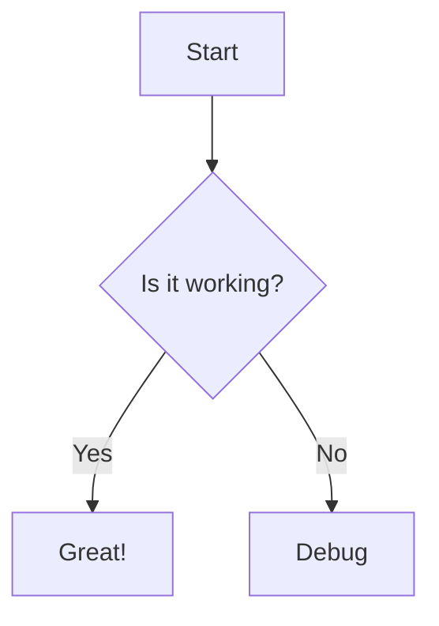

# API Reference: Markdown

Complete guide to writing and formatting markdown in MarkoPress, including syntax highlighting, custom containers, and extensions.

## Overview

MarkoPress uses `markdown-it` for rendering markdown with powerful extensions:

- ✅ GitHub Flavored Markdown (GFM)
- ✅ Syntax highlighting with Shiki
- ✅ Custom containers (tip, warning, danger)
- ✅ Automatic header anchors
- ✅ Emoji support
- ✅ Task lists
- ✅ Tables

## Basic Syntax

### Headings

```markdown
# Heading 1
## Heading 2
### Heading 3
#### Heading 4
##### Heading 5
###### Heading 6
```

**Result:**

# Heading 1
## Heading 2
### Heading 3
#### Heading 4
##### Heading 5
###### Heading 6

### Paragraphs

```markdown
This is a paragraph.

This is another paragraph separated by a blank line.
```

### Emphasis

```markdown
**Bold text** or __bold text__
*Italic text* or _italic text_
***Bold and italic***

~~Strikethrough~~
```

**Result:**

**Bold text** or __bold text__
*Italic text* or _italic text_
***Bold and italic***

~~Strikethrough~~

### Links

```markdown
[Link text](https://example.com)
[Link with title](https://example.com "Link title")

[Relative link](/guides/getting-started)
[Link to section](#headings)
```

**Result:**

[Link text](https://example.com)
[Link with title](https://example.com "Link title")

[Relative link](/guides/getting-started)
[Link to section](#headings)

### Images

```markdown


```

**Result:**


## Lists

### Unordered Lists

```markdown
- Item 1
- Item 2
  - Nested item
  - Another nested item
- Item 3
```

**Result:**

- Item 1
- Item 2
  - Nested item
  - Another nested item
- Item 3

### Ordered Lists

```markdown
1. First item
2. Second item
3. Third item
   1. Nested numbered
   2. Another nested
4. Fourth item
```

**Result:**

1. First item
2. Second item
3. Third item
   1. Nested numbered
   2. Another nested
4. Fourth item

### Task Lists

```markdown
- [x] Completed task
- [ ] Incomplete task
- [x] Another completed
- [ ] Another incomplete
```

**Result:**

- [x] Completed task
- [ ] Incomplete task
- [x] Another completed
- [ ] Another incomplete

### Definition Lists

```markdown
Term 1
: Definition 1

Term 2
: Definition 2
```

**Result:**

Term 1
: Definition 1

Term 2
: Definition 2

## Code

### Inline Code

````markdown
`inline code`
````

**Result:**

`inline code`

### Code Blocks

````markdown
```
function hello() {
  console.log('Hello, world!');
}
```
````

**Result:**

```javascript
function hello() {
  console.log('Hello, world!');
}
```

### Syntax Highlighting

Specify language after opening fences:

````markdown
```javascript
function greet(name) {
  return `Hello, ${name}!`;
}
```
````

**Result:**

```javascript
function greet(name) {
  return `Hello, ${name}!`;
}
```

### Supported Languages

- `javascript` / `js`
- `typescript` / `ts`
- `python` / `py`
- `ruby` / `rb`
- `go`
- `rust`
- `java`
- `csharp` / `c#` / `csharp`
- `cpp` / `c++`
- `html`
- `css`
- `json`
- `yaml` / `yml`
- `bash` / `sh`
- `markdown` / `md`
- And many more!

### Line Numbers

Enable line numbers in config:

```typescript
export default defineConfig({
  markdown: {
    lineNumbers: true,
  },
});
```

Or per code block:

````markdown
```js{1,3-5}
const a = 1;     // Line 1
const b = 2;     // Line 2
const c = 3;     // Line 3
const d = 4;     // Line 4
const e = 5;     // Line 5
```
````

## Tables

### Basic Tables

```markdown
| Header 1 | Header 2 | Header 3 |
|----------|----------|----------|
| Cell 1   | Cell 2   | Cell 3   |
| Cell 4   | Cell 5   | Cell 6   |
```

**Result:**

| Header 1 | Header 2 | Header 3 |
|----------|----------|----------|
| Cell 1   | Cell 2   | Cell 3   |
| Cell 4   | Cell 5   | Cell 6   |

### Alignment

```markdown
| Left | Center | Right |
|:-----|:------:|------:|
| L    | C      | R     |
| Left | Center | Right|
```

**Result:**

| Left | Center | Right |
|:-----|:------:|------:|
| L    | C      | R     |
| Left | Center | Right|

### Complex Tables

```markdown
| Feature | Status | Notes |
|---------|--------|-------|
| **HMR** | ✅ | Instant updates |
| **TypeScript** | ✅ | Full support |
| **Plugins** | ✅ | Extensible |
```

**Result:**

| Feature | Status | Notes |
|---------|--------|-------|
| **HMR** | ✅ | Instant updates |
| **TypeScript** | ✅ | Full support |
| **Plugins** | ✅ | Extensible |

## Blockquotes

### Basic Blockquotes

```markdown
> This is a blockquote.
>
> It can span multiple lines.
```

**Result:**

> This is a blockquote.
>
> It can span multiple lines.

### Nested Blockquotes

```markdown
> Level 1
>> Level 2
>>> Level 3
```

**Result:**

> Level 1
>> Level 2
>>> Level 3

### Blockquotes with Other Elements

```markdown
> **Heading**
>
> - List item 1
> - List item 2
>
> `code` in blockquote
```

**Result:**

> **Heading**
>
> - List item 1
> - List item 2
>
> `code` in blockquote

## Custom Containers

MarkoPress provides custom container syntax.

### Tip Container

```markdown
:::tip
This is a helpful tip!
:::
```

**Result:**

:::tip
This is a helpful tip!
:::

### Warning Container

```markdown
:::warning
Be careful with this!
:::
```

**Result:**

:::warning
Be careful with this!
:::

### Danger Container

```markdown
:::danger
This is dangerous!
:::
```

**Result:**

:::danger
This is dangerous!
:::

### Custom Titles

```markdown
:::tip Pro Tip
Use keyboard shortcuts to work faster!
:::
```

**Result:**

:::tip Pro Tip
Use keyboard shortcuts to work faster!
:::

## Horizontal Rules

```markdown
***

---

___
```

**Result:**

***

---

___

## Emoji

```markdown
:smile: :rocket: :tada:
:heart: :star: :fire:
```

**Result:**

:smile: :rocket: :tada:
:heart: :star: :fire:

### Common Emoji

- :smile: `:smile:`
- :thumbsup: `:thumbsup:`
- :warning: `:warning:`
- :link: `:link:`
- :memo: `:memo:`
- :information_source: `:information_source:`

## HTML in Markdown

You can use raw HTML in your markdown:

```markdown
<div class="custom-box">
  This is a custom div with **markdown** inside.
</div>

<details>
  <summary>Click to expand</summary>

  Hidden content here!
</details>
```

**Result:**

<div class="custom-box">
  This is a custom div with **markdown** inside.
</div>

<details>
  <summary>Click to expand</summary>

  Hidden content here!
</details>

## Frontmatter

Add metadata to your files:

```yaml
---
title: "Page Title"
description: "Page description"
date: 2024-01-15
author: "Author Name"
tags: ["tag1", "tag2"]
order: 1
draft: false
---

# Content here
```

### Available Fields

| Field | Type | Description |
|-------|------|-------------|
| `title` | string | Page title |
| `description` | string | SEO description |
| `date` | Date | Publication date |
| `author` | string | Author name |
| `tags` | string[] | Tags array |
| `categories` | string[] | Categories |
| `order` | number | Sidebar ordering |
| `draft` | boolean | Exclude from build |
| `excerpt` | string | Custom excerpt |

## Header Anchors

Headers automatically get anchor links:

```markdown
## My Section
```

Generates:

```html
<h2 id="my-section">
  My Section
  <a class="header-anchor" href="#my-section">#</a>
</h2>
```

### Custom Anchors

```markdown
## My Section {#custom-anchor}
```

## Links and References

### Internal Links

Link to other pages:

```markdown
[Getting Started](/guides/getting-started)
[About Page](/about)
```

### Section Links

Link to sections within pages:

```markdown
[See Headings section](#headings)
```

### External Links

External links open in new tab automatically when using full URLs:

```markdown
[MarkoPress](https://markopress.dev)
```

## Advanced Features

### Footnotes

```markdown
This is a statement with a footnote[^1].

[^1]: This is the footnote content.
```

**Result:**

This is a statement with a footnote[^1].

[^1]: This is the footnote content.

### Abbreviations

```markdown
*[HTML]: Hyper Text Markup Language
*[CSS]: Cascading Style Sheets

HTML and CSS are fundamental.
```

**Result:*

*[HTML]: Hyper Text Markup Language
*[CSS]: Cascading Style Sheets

HTML and CSS are fundamental.

### Definitions

```markdown
Term 1
: Definition 1

Term 2
: Definition 2a
: Definition 2b
```

**Result:**

Term 1
: Definition 1

Term 2
: Definition 2a
: Definition 2b

### Superscript and Subscript

```markdown
H~2~O is water.
E = mc^2^
```

**Result:**

H~2~O is water.
E = mc^2^

### Marked Text

```markdown
==Highlighted text==
```

**Result:**

==Highlighted text==

## Math

MarkoPress supports LaTeX math with KaTeX.

### Inline Math

```markdown
The formula is $E = mc^2$.
```

**Result:**

The formula is $E = mc^2$.

### Block Math

```markdown
$$
\frac{n!}{k!(n-k)!} = \binom{n}{k}
$$
```

**Result:**

$$
\frac{n!}{k!(n-k)!} = \binom{n}{k}
$$

## Mermaid Diagrams

Create diagrams with Mermaid:

````markdown

````

## Configuration

Configure markdown behavior in `markopress.config.ts`:

```typescript
export default defineConfig({
  markdown: {
    // Show line numbers
    lineNumbers: true,

    // Syntax highlighting theme
    theme: {
      light: 'github-light',
      dark: 'github-dark',
    },

    // markdown-it options
    options: {
      html: true,         // Allow HTML
      linkify: true,      // Auto-detect links
      typographer: true,  // Smart quotes
    },

    // Custom markdown-it plugins
    plugins: [
      require('markdown-it-emoji'),
      require('markdown-it-footnote'),
    ],
  },
});
```

## Best Practices

### 1. Use Consistent Formatting

```markdown
# ✅ Good
## Subheading
Content here.

# ❌ Bad
##Subheading
Content here.
```

### 2. Escape Special Characters

```markdown
Not a link: https:\/\/example.com
Not bold: \*\*text\*\*
```

### 3. Use Code Blocks for Code

```markdown
# ✅ Good
Use `const` for constants.

# ❌ Bad
Use const for constants.
```

### 4. Add Alt Text to Images

```markdown
# ✅ Good


# ❌ Bad

```

## Troubleshooting

### Code Not Highlighting

Ensure language is specified:

````markdown
# ✅ Good
```javascript
code here
```

# ❌ Bad
```
code here
```
````

### Tables Not Rendering

Ensure proper alignment:

```markdown
# ✅ Good
| A | B |
|---|---|
| 1 | 2 |

# ❌ Bad
| A | B |
| 1 | 2 |
```

## Next Steps

- 📖 [Content Organization](/guides/demo-guides-content)
- 🎨 [Theming](/guides/theming)
- 🔌 [Plugins](/guides/plugins)
